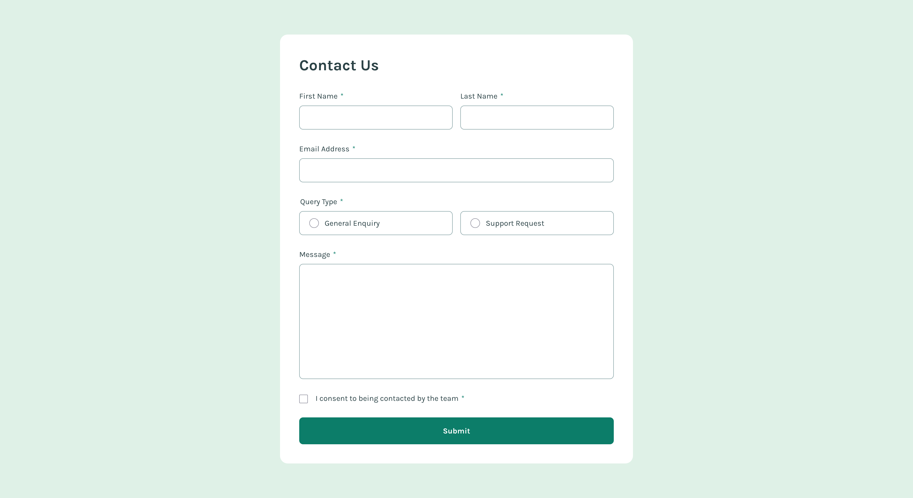

# Contact Form 

A solution to the [Contact form challenge on Frontend Mentor](https://www.frontendmentor.io/challenges/contact-form--G-hYlqKJj). 

## Screenshot

## Users should be able to:
- Complete the form and see a success toast message upon successful submission
- Receive form validation messages if:
  - A required field has been missed
  - The email address is not formatted correctly
- Complete the form only using their keyboard
- Have inputs, error messages, and the success message announced on their screen reader
- View the optimal layout for the interface depending on their device's screen size
- See hover and focus states for all interactive elements on the page

## Links
- [Source](https://github.com/mothy-08/fm-contact-form)
- [Live](https://mothy-08.github.io/fm-contact-form/)

## Built with
- HTML
- CSS
- Vanilla JS
